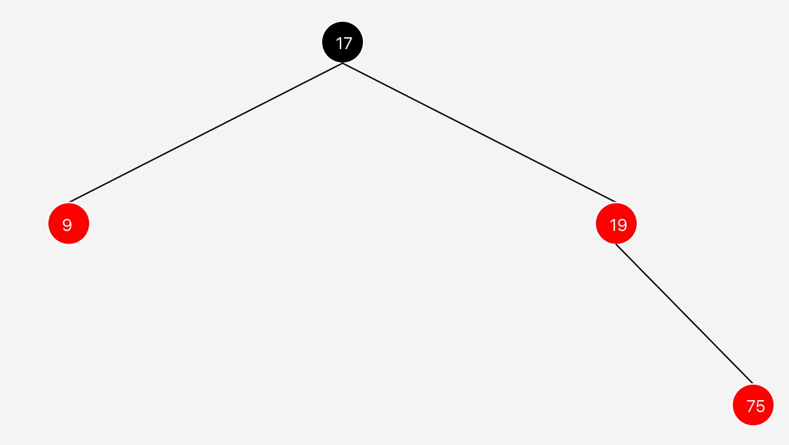
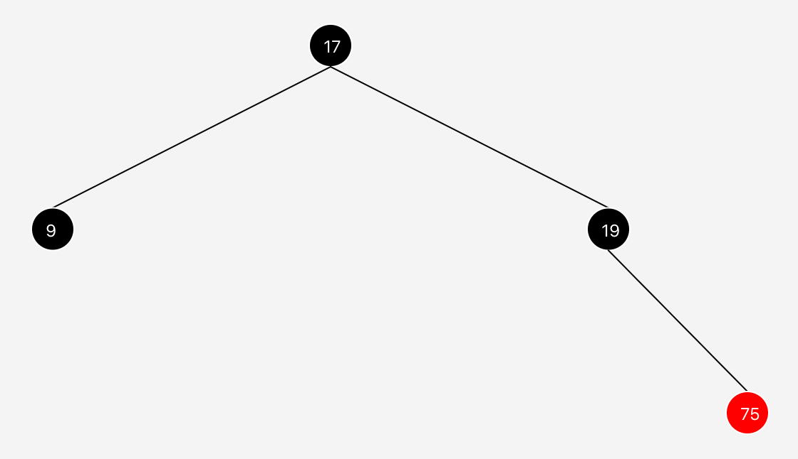
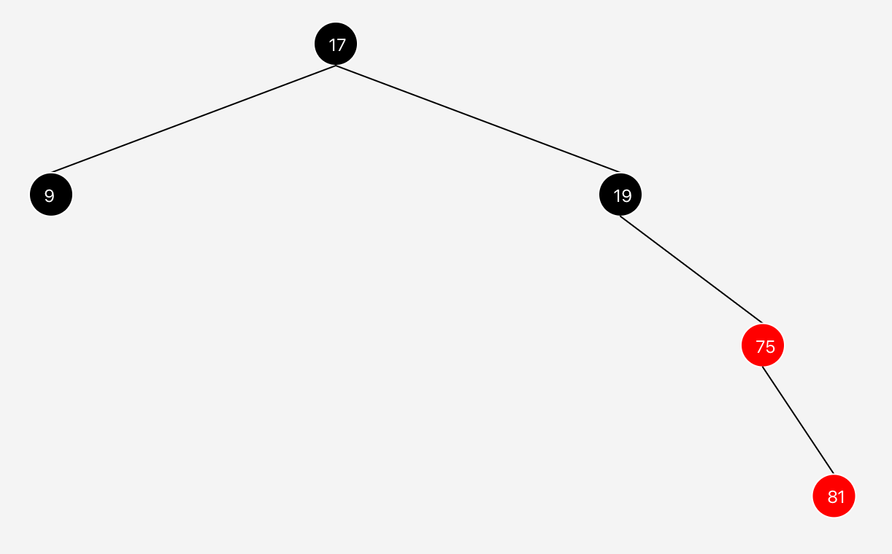
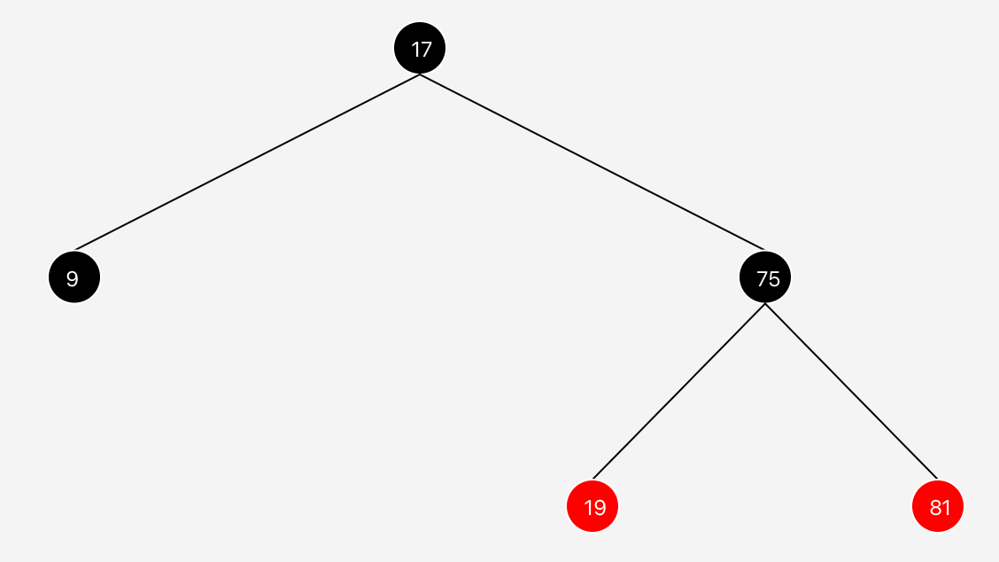
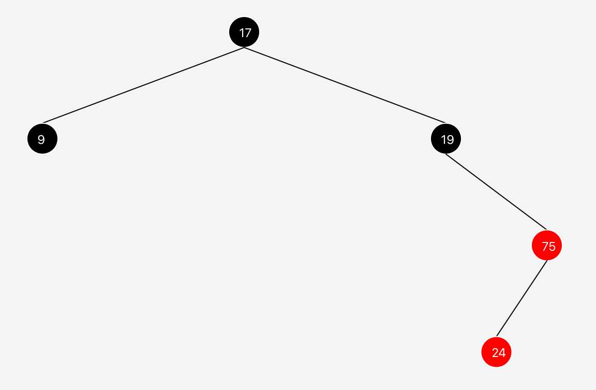
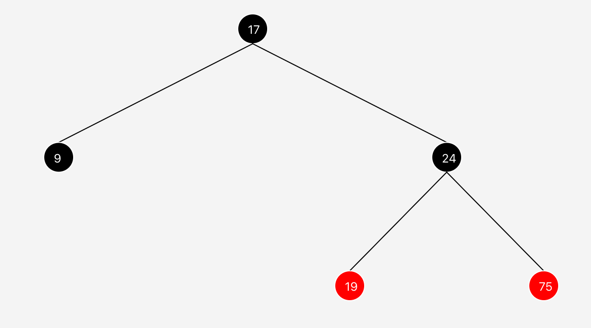

## L07 - RedBlackTreeVisualizer

A RedBlack Tree is a way to utilize a visual element to help us order our data. Sure, we could call it an A/B tree, or any other binary node setup, but making them red and black makes it easier for us to look at the data visually and see when they are out of order.

### To accomplish this, the RedBlack Tree has the following rules:
1) Nodes are either red or black
2) The Root is Black
3) All NIL leaves are black
4) Red nodes must not have red children
5) All paths from a node to those below contain the same number of black nodes

### In this lab, we'll be writing a fixInsert method to repair the balance of the RedBlack Tree.

To address this, we'll discuss Grandparents, Parents and Piblings (Parent's sibling aka Aunts and Uncles, you may use whichever wording you prefer, although Uncle is the most commonly used of the three).

The conditions our fixInsert must address:
### Condition! Root is _Red_
Add code to fixInsert to cause the root to always be black.

### Condition! Parent and Pibling are _Red_
Run Test0 in the visualizer to see this result:

Inserting 75 has caused us to violate Rule 4, RED nodes may not have RED children. However, in this case, since the Parent & Pibling are both red, they can simply be recolored to BLACK.

_Important: The grandparent can be now colored RED! This is also a good place to try to balance the grandparent!_

Add logic to the fixInsert method to handle this condition.

### Condition! Parent is _Red_, Pibling is _Black_, Inserted 'Linear' Grandchild
When you run test 1, you should see the following:

Since these elements are moving in the same direction, only one rotation, in the opposite direction of the imbalance is required. 

_Tip: Since node is the newly inserted element, rotate around the grandparent!_

Recolor as necessary to restore proper coloring to the Tree. Your final result for Test 1 should appear like this:

### Condition! Parent is _Red_, Pibling is _Black_, Inserted 'Zaggy' Grandchild

When you run test 2, you should see the following:

In this case, since the inserted node is in opposite direction from its parent's lineage, a double rotation will be required.

The first rotation, around the parent, in the parent's direction will straighten out the chain so our code from the previous condition can complete the work.

_Tip: if you do fallthrough to the previous code, you may need to reset your node's reference._

Your final result for Test 2 should look like this:

## Happy Coding!
